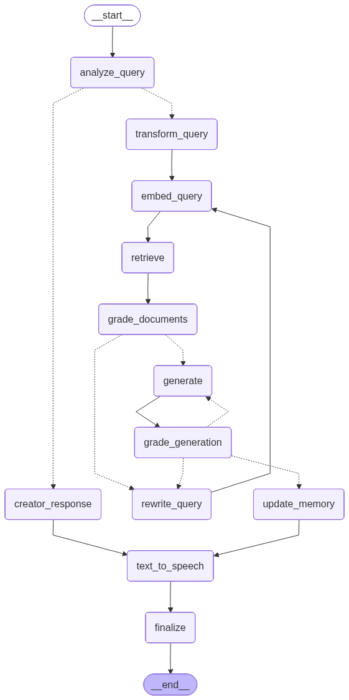

# 🔬 GyroGlove Research Assistant — Advanced RAG Chatbot

> **Advanced RAG pipeline** built with LangGraph — answers complex 
> queries about the GyroGlove tremor stabilization research paper 
> using semantic search, self-correcting generation loops, 
> conversation memory, and text-to-speech output.

---

## 📊 Key Capabilities

| Feature | Detail |
|---------|--------|
| Knowledge source | GyroGlove tremor stabilization research paper |
| RAG technique | Advanced — query transformation, document grading, self-correction |
| Response format | Text + Audio (TTS) |
| Memory | Conversation memory with update loop |
| Vector DB | AstraDB with HuggingFace embeddings |
| Interface | Streamlit UI |

---

## 🏗️ LangGraph Architecture

> **Self-correcting RAG loop** — if retrieved documents are 
> irrelevant or generation quality is poor, the system 
> automatically rewrites the query and re-retrieves. 
> Only finalizes when generation meets quality threshold.

---

## ⚡ Advanced RAG Techniques

This is not a basic RAG pipeline. It implements:

- **Query transformation** — rewrites user query for better retrieval before embedding
- **Document grading** — evaluates retrieved chunks for relevance before generation
- **Generation grading** — scores the LLM output for accuracy and completeness
- **Self-correction loop** — if generation fails quality check, rewrites query and re-retrieves automatically
- **Conversation memory** — updates memory after each interaction for context-aware responses
- **Text-to-speech output** — responds in both text and audio

---

## 🛠️ Tech Stack

| Layer | Technology |
|-------|-----------|
| Pipeline Orchestration | LangGraph |
| LLM | Gemini (Google Generative AI) |
| Embeddings | HuggingFace all-MiniLM-L6-v2 |
| Vector Database | AstraDB |
| Text-to-Speech | pyttsx3 / gTTS |
| PDF Processing | pdfplumber / PyMuPDF |
| Frontend | Streamlit |
| Language | Python |

---

## 📸 Demo

> 🎥 [Watch Demo](results/demo-recording.mp4)

---

## 📫 Contact

**Adnan Abdullah** — Agentic AI Engineer & AI Team Lead

---

*Built with LangGraph + Gemini + AstraDB · Advanced RAG with 
self-correction loops · Text + Audio responses*
